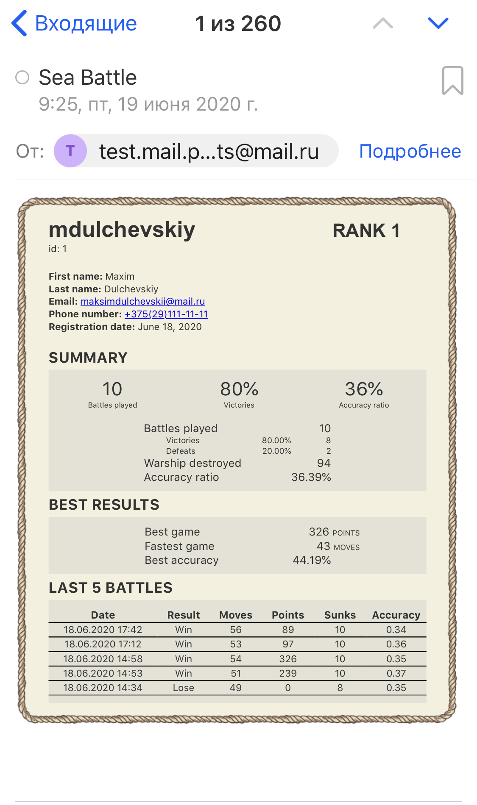

# Sea Battle

This app is my vision of the classic Sea Battle game. This project also reflects my current knowledge of python and Django. The emphasis was placed on the back-end, so in terms of the front-end, there are some nuances of optimization on mobile devices, which in turn don't affect the correct work of the application.

Link to Heroku application: www.md-sea-battle.herokuapp.com  
Link to the web-site: www.seabattle.xyz

## Description

- сайт предполагает возможность одновременной игры нескольких пользователей в отдельных браузерах по принципу: 
новый браузер - отдельное игровое окружение. Для каждого условного игрового окружения есть возможность игры в 
качестве гостя или зарегистрированного пользователя. Игра в качестве гостя привязана к игровому окружению (браузеру). 
Начатая зарегистрированным игроком игра может быть продолжена в любом другом браузере. Для этого надо выйти из 
аккаунта в старом браузере и авторизоваться в новом;

- переход на страницу авторизации пользователя предусмотрен с главной страницы и страницы подготовки к игре. 
На странице авторизации предлагается ввести логин и пароль. В случае отсутствия заполнения данных полей, 
неправильного логина или неправильного пароля будет выведено соответствующее уведомление. Также если пользователь 
уже авторизирован в одном браузере, то авторизация через другой браузер невозможна и будет сопровождаться 
соответствующим уведомлением. Если пользователь забыл выйти из аккаунта в браузере, к которому не имеет доступа, 
ему будет необходимо подождать: спустя заданное время будет произведен автоматический выход из всех неактивных 
аккаунтов. Допустимое время отсутствия активности задано параметром "MAX_IDLE_TIME" в файле "settings.py" и 
равняется 30 минутам. После того как пользователь авторизуется, будет открыта страница, с которой он перешел 
на страницу авторизации, если такая была, иначе будет переход на домашнюю страницу. При этом, если до 
авторизации пользователь сначала зарегистрировался, страница регистрации будет проигнорирована. 
Страницу авторизации нельзя открыть через ввод ее url'а, если пользователь уже авторизирован;

<p align="center">   </p>

- на странице регистрации предлагается ввести данные о пользователе. Все поля являются обязательными. 
Рядом с некоторыми полями есть сноски, в которых описаны ограничения по вводу. Если поля не заполнены, 
не валидны или пользователь с таким логином или почтой существует, то отобразится соответствующее уведомление. 
Переход на страницу регистрации пользователя предусмотрен по ссылке со страницы авторизации. Также возможен 
переход по ее url'у. Если страница регистрации была открыта по ссылке со страницы авторизации или по url'у при 
условии, что нет авторизированного пользователя, то действуют описанные выше правила перехода на предыдущую 
страницу. Если страница регистрации была открыта по url'у при условии, что присутствует авторизированный 
пользователь, то после прохождения регистрации будет переход на страницу, которая была открыта до перехода 
на страницу регистрации;

<p align="center">   </p>

- после прохождения регистрации всю информацию о пользователе можно найти на его странице. Переход на страницу 
пользователя возможен по ссылке из таблицы лидеров, блока авторизации на домашней странице или со страницы игры 
при условии авторизации пользователя. Переход в профиль также возможен по двум url'ам ("account/", "account/username"). 
При использовании url'а "account/" будет переход на страницу авторизированного пользователя, иначе переход на страницу 
авторизации. При использовании url'а "account/username" будет переход на страницу данного пользователя, если такой 
существует, при этом в случае его авторизации будет доступен функционал по редактированию профиля, иначе профиль 
будет находиться в режиме просмотра с отсутсвием функционала по его редактированию и скрытыми личными данными. На 
странице игрока отображаются фото профиля (по умолчанию мопс-пират) и личные данные с возможностью их редактирования, 
также указан ранг пользователя и вся его игровая статистика, включающая количество боев, побед, поражений, точность, 
информацию по пяти последним играм и пр. Присутствует возможность отправить на email пользователя всю его статистику. 
В файле "settings.py" в переменной "MAX_FILE_SIZE" задается максимальный размер загружаемого изображения профиля, 
по умолчанию равный 2MB. Также изображение профиля должно быть в формате квадрата;

<p align="center">   </p>
<p align="center">   </p>

- переход на главную страницу сайта осуществляется с помощью адресной строки или специальных стрелок на других 
страницах в левом верхнем углу. На главной странице сайта отображается таблица лидеров, если в базе данных 
присутствуют победные игры, если отсутствуют - таблица не отображается. После нажатия кнопки "Start Game" будет 
произведен переход на страницу подготовки к игре, если до этого не была начата игра, иначе будет предложено начать 
новую игру или продолжить старую;

<p align="center">  </p>

- для подготовки к игре на соответствующей странице необходимо расположить на игровом поле заданное количество 
кораблей в соответствии с правилами, с которыми можно ознакомиться внизу данной страницы. На странице присутствует 
возможность автоматического заполнения поля кораблями в случайном порядке по нажатию кнопки "Random". Кнопка "Clear" 
позволяет очистить игровое поле. Если игрок заполняет поле сам и количество закрашенных клеток будет меньше 
положенного, количество кораблей будет отличаться от требуемого или корабли будут соприкасаться, то будет выведено 
соответствующее уведомление. Если поле заполнено в соответствии со всеми правилами, то после нажатия кнопки 
"Start Game" будет начата новая игра. Если начата новая игра, страница подготовки к игре недоступна;

<p align="center">    </p>

- на странице самой игры отображаются два поля: поле противника и поле игрока. Для выстрела по полю противника 
необходимо выбрать клетку на его поле и нажать "Fire". Если было попадание, то выбранная клетка станет желтой и 
пометится символом огня. Если после попадания корабль противника затонул, то площадь корабля становится красной, 
отмечается его периметр, а сами клетки корабля помечаются маркером "x". Если был промах, то такая клетка отмечается 
точкой по центру и ход переходит к противнику. Для хода противника необходимо нажать кнопку "Defend". Также на 
странице игры присутствует информация об игроке (гость или зарегистрированный пользователь), о количестве 
оставшихся кораблей противника, их составе, количестве ходов игрока, комбо-очках и информация по всем совершенным 
ходам. Комбо-очки начисляются за каждое попадание подряд по формуле (n-1)*5, где n - количество попаданий подряд. 
Присутствует возможность досрочно завершить игру нажатием кнопки "End Game", после которой необходимо будет 
подтвердить завершение. Когда игра заканчивается, появляется уведомление о проигрыше или выигрыше игрока. Если 
игра не начата, страница подготовки недоступна;

<p align="center">  </p>
<p align="center">  </p>

- в случае перехода на страницу, которая не существует, или ошибки сервера будет выведена соответствующая информация. 

<p align="center"> </p>

## Getting Started
1. Installing virtualenv

   ```
   pip install virtualenv
   ```
2. Start a new virtual environment
   * Create
   
     ```
     unix:    virtualenv -p python3 .venv
     windows: virtualenv .venv
     ```
   * Activate
   
     ```
     unix:    source .venv/bin/activate
     windows: .venv\Scripts\activate
     ```
   * Deactivate
   
     ```
     deactivate
     ```
4. Installing packages

   ```
   pip install -r requirements.txt
   ```
5. Run Server

   ```
   python manage.py runserver
   ```
## Running the tests
More than 140 tests have been written for this application which cover more than 90% functionality. 
The other 10% are mostly built-in or simple functions that don't need testing.  
   ```
   python manage.py test
   ```
## Deploying to Heroku
0. Create account on [Heroku](https://signup.heroku.com/)  

1. Download and install the [Heroku CLI](https://devcenter.heroku.com/articles/heroku-cli)

2. Create Git repository  
   * Initialize
   
     ```
     git init
     ```
   * Add gitignore
   
     ```
     git add gitignore
     git commit -m "Add gitignore."
     ```
   * Add Sea Battle app files
   
     ```
     git add .
     git commit -m "Add sea battle app files"
     ```
3. Log in to Heroku account and create application

   ```
   heroku login
   heroku create app-name
   ```
4. Commit changes and deploy app to Heroku using Git

   ```
   git add .
   git commit -m "Deploy."
   git push heroku master
   ```
5. Make migrations and create superuser

   ```
   heroku run python manage.py migrate
   heroku run python manage.py createsuperuser
   ```
6. Set environment variables

   ```
   heroku config:set DJANGO_DEBUG=""
   heroku config:set EMAIL_HOST_PASSWORD="email_host_password"
   heroku config:set AWS_ACCESS_KEY_ID="aws_access_key_id"
   heroku config:set AWS_SECRET_ACCESS_KEY="aws_secret_access_key"
   ```